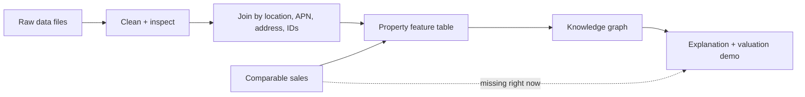
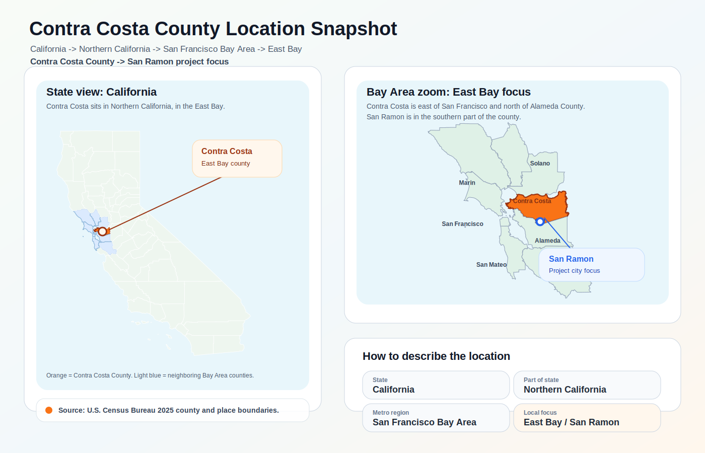
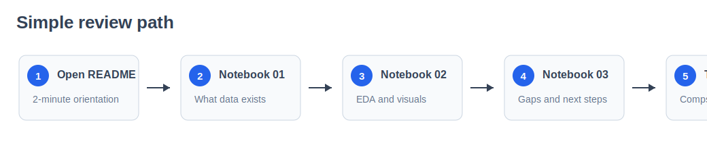
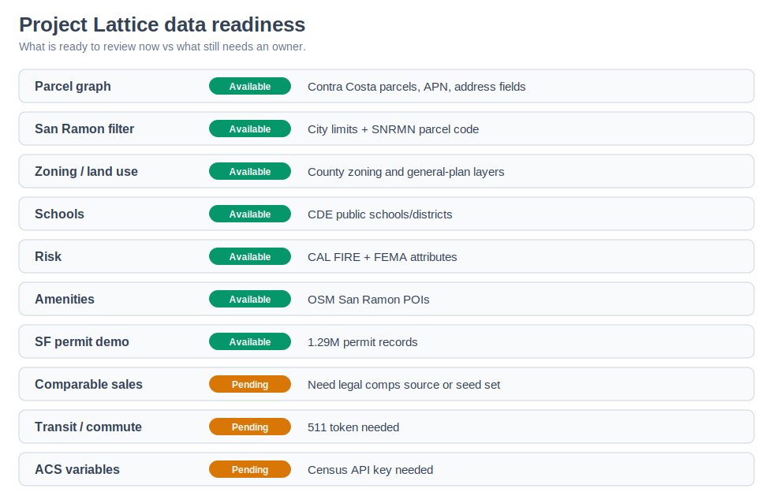
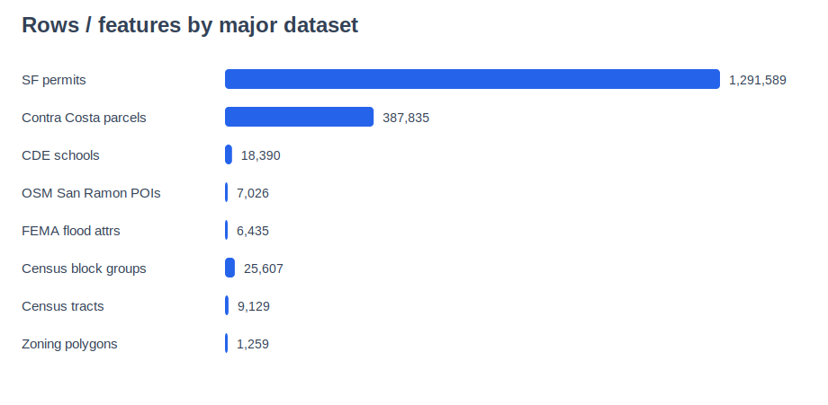
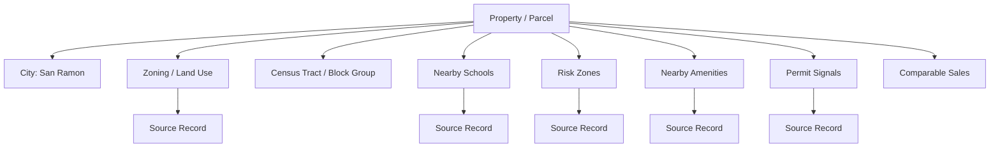

# Project Lattice Data Review

This repo is the starting point for Project Lattice.

Project Lattice is a real-estate intelligence product. The idea is simple:

> Given a property, can we explain whether it looks fairly priced, overpriced, undervalued, risky, or promising, using real source data?

Instead of stopping at "the value is X," we want the product to explain **why**:

- which parcel the property sits on
- what city, tract, school area, and risk zones it belongs to
- what permits, zoning, amenities, schools, flood zones, and fire zones are nearby
- which facts came from which source
- what data is still missing before we can trust a valuation model

My current read:

> We have enough public data to build the knowledge graph and explanation demo. Production-grade valuation still depends on comparable sales.

---

## Background

The product idea is not just "show a home price."

The product idea is:

1. Start with a real property.
2. Gather real facts about that property and the area around it.
3. Connect those facts to public sources.
4. Explain what looks good, bad, risky, promising, or missing.
5. Use comparable sales only when we have a legal, reviewable source for them.

That is why this repo is organized around data first.

Before building the final app, we want to answer:

| Question | Why it matters |
| --- | --- |
| Do we have real property records? | Parcels/APNs/addresses help us identify the property clearly. |
| Do we have location context? | City, Census, zoning, and land-use layers tell us where the property sits. |
| Do we have nearby signals? | Schools, amenities, permits, flood, and fire layers help explain risk and opportunity. |
| Do we have source proof? | Every important claim can point back to a source file or source URL. |
| Do we have comparable sales? | This is required before we can trust a valuation number. |

The current repo answers most of the context questions. It does not yet solve comparable sales.

---

## The Simple Mental Model

Think of this like building a case file for a house.

Each dataset adds one kind of clue:

| Clue | Example question it helps answer |
| --- | --- |
| Parcels | What exact property/land parcel are we talking about? |
| City boundaries | Is this parcel actually in San Ramon? |
| Zoning / land use | What is the land allowed or planned for? |
| Schools | What schools/districts are nearby? |
| Flood / fire risk | Is there a known risk zone? |
| Amenities / POIs | What useful places are nearby? |
| Permits | Are there renovation or development signals? |
| Comparable sales | What similar homes sold for? |

Then we connect those clues into a knowledge graph.



---

## Start Here

If you are opening this repo for the first time, follow this order.

| Step | Open | Why |
| --- | --- | --- |
| 1 | `DATA_FILES.md` | Direct list of the actual raw data files uploaded to GitHub. |
| 2 | `data/README.md` | Simple map of the data folders and what is raw vs sampled vs metadata. |
| 3 | `docs/dataset-catalog.md` | Plain-English explanation of each dataset: county/geography, source, type, and purpose. |
| 4 | `notebooks/01_data_inventory.ipynb` | Executed notebook showing what data is present and what is pending. |
| 5 | `notebooks/02_executed_eda.ipynb` | Executed notebook with the main EDA charts and tables. |
| 6 | `notebooks/03_availability_and_next_steps.ipynb` | What is ready, what is blocked, and what we can do next. |
| 7 | `docs/knowledge-graph-plan.md` | Easy walkthrough of how raw data becomes a graph. |
| 8 | `docs/project-lattice-data-review.md` | More detailed team review notes. |

If you only have two minutes, open:

1. `DATA_FILES.md`
2. `docs/dataset-catalog.md`
3. `reports/visual_review.md`

## Visual Checkpoints

These visuals give the quickest orientation.



Contra Costa County is in **California**, in the **northern part of the state**, inside the **San Francisco Bay Area / East Bay**. The project city focus, **San Ramon**, is in the southern part of Contra Costa County.







---

## What Data Is Already In GitHub?

The actual source files are committed under:

`data/raw/`

High-level view:

| Data area | Geography | Source | Status | Folder/file |
| --- | --- | --- | --- | --- |
| Parcels | Contra Costa County | Contra Costa County GIS / Assessor | Available | `data/raw/contra_costa/Parcels_Public_May2026.zip` |
| City limits | Contra Costa County | Contra Costa County GIS / Planning | Available | `data/raw/contra_costa/BND_DCD_City_Limits.zip` |
| Zoning / land use | Contra Costa County | Contra Costa County GIS / Planning | Available | `data/raw/contra_costa/` |
| Census boundaries | California statewide | U.S. Census Bureau TIGER/Line | Available | `data/raw/census/` |
| County location map boundary | United States; used for California/Contra Costa | U.S. Census Bureau Cartographic Boundary Files | Available | `data/raw/census/cb_2025_us_county_500k.zip` |
| Schools | California statewide, includes Contra Costa/San Ramon rows | California Department of Education | Available | `data/raw/schools/` |
| Wildfire risk | Contra Costa project area | CAL FIRE / Office of the State Fire Marshal | Available | `data/raw/risk/` |
| Flood risk | Contra Costa project area | FEMA NFHL ArcGIS service | Available as attributes | `data/raw/risk/` |
| Amenities / POIs | San Ramon bbox | OpenStreetMap via Overpass API | Available | `data/raw/osm/` |
| Building permits | City and County of San Francisco | DataSF / San Francisco Department of Building Inspection | Available as split CSV parts | `data/raw/san_francisco/` |
| Comparable sales | Target metro TBD | TBD: county records, MLS/partner feed, purchased data, or manual seed set | Missing | Not included yet |
| 511 transit / GTFS | Bay Area | 511.org | Missing | Needs API token |
| ACS variables | Census tracts/block groups | U.S. Census Bureau ACS API | Missing | Needs Census API key |

For the full raw-file list, read:

`DATA_FILES.md`

For what each dataset means, read:

`docs/dataset-catalog.md`

---

## How The Folders Work

```text
DATA_FILES.md                 Direct index of actual raw files uploaded to GitHub
README.md                     This walkthrough

data/
  README.md                    How to read the data folder
  raw/                        Actual downloaded source files
  processed/samples/          Small sample files created during EDA
  metadata/                   Source/service metadata
  source_registry.csv         Master list of sources and open questions

docs/
  README.md                    How to read the docs folder
  dataset-catalog.md          Plain-English dataset guide
  knowledge-graph-plan.md     How the data becomes a knowledge graph
  project-lattice-data-review.md
  project-lattice-data-sources.md
  team-collaboration-plan.md

notebooks/
  01_data_inventory.ipynb
  02_executed_eda.ipynb
  03_availability_and_next_steps.ipynb

reports/
  README.md                    How to read the EDA outputs
  visual_review.md            Short visual walkthrough
  figures/                    SVG charts and location snapshot used in README/reports
  profiles/                   Small count tables from EDA
  dataset_inventory.csv       File-level inventory
  dataset_catalog.csv         Table version of docs/dataset-catalog.md

scripts/
  README.md                    What each script does
  download_project_lattice_data.py
  eda_project_lattice_data.py
  profile_project_lattice_data.py
  build_review_assets.py
  build_location_snapshot.py
  reconstruct_large_files.py
```

---

## How To Look At The Data

The easiest review path is to start with the summary files before opening the biggest files.

Start with the summary files:

1. `docs/dataset-catalog.md`
   Understand what each dataset is.

2. `reports/dataset_inventory.csv`
   Check row counts, file types, and columns.

3. `data/processed/samples/`
   Open small samples before opening large raw data.

4. `notebooks/02_executed_eda.ipynb`
   Look at the already-run charts and tables.

When reviewing any dataset, answer these questions:

| Question | Why it matters |
| --- | --- |
| What geography does this cover? | We want to confirm whether it supports San Ramon, Contra Costa, SF, or all of California. |
| What is the source agency? | Every claim in Lattice can point back to a source. |
| What is the join key? | APN, address, geometry, tract ID, school ID, or coordinates help us connect data. |
| How many records are there? | Shows whether the dataset is big enough to be useful. |
| What columns are missing? | Missing fields can block features. |
| Is this public/context data or valuation target data? | Context explains a property; comparable sales train/validate valuation. |

---

## What The EDA Already Shows

Key numbers from the executed EDA:

| Area | What we found |
| --- | --- |
| Contra Costa parcels | 387,835 parcel records |
| San Ramon parcel code | `SNRMN` appears on 27,756 parcel rows |
| Parcel address completeness | 94.2% have street-number/name/city fields |
| SF permits | 1,291,589 permit records |
| SF permits with point location | 99.7% |
| CDE school/district rows | 18,390 statewide rows |
| Contra Costa school rows | 479 rows |
| OSM San Ramon POIs | 7,026 elements |
| FEMA flood attributes | 6,435 rows |

Open this for the visual version:

`notebooks/02_executed_eda.ipynb`

---

## How This Becomes A Knowledge Graph

The knowledge graph is just a connected map of facts.

Example:



The first version can create these nodes:

| Node | Meaning | Current data source |
| --- | --- | --- |
| `Property` / `Parcel` | The land/property unit | Contra Costa parcel file |
| `City` | City boundary / city membership | Contra Costa city limits |
| `ZoningDistrict` | Zoning and planning context | Contra Costa zoning/general plan |
| `CensusArea` | Tract/block group context | Census TIGER boundaries |
| `School` | Nearby school/district context | CDE public schools/districts |
| `RiskZone` | Flood/fire risk | FEMA + CAL FIRE |
| `Amenity` | Nearby POIs | OpenStreetMap |
| `Permit` | Building/development signal | SF permits for demo |
| `ComparableSale` | Actual sale evidence | Missing right now |
| `SourceRecord` | Provenance for every claim | Source URLs and metadata |

The first version can create these edges:

| Edge | Example |
| --- | --- |
| `Property LOCATED_IN City` | Parcel is inside San Ramon |
| `Property HAS_ZONING ZoningDistrict` | Parcel intersects zoning polygon |
| `Property INSIDE RiskZone` | Parcel intersects fire/flood zone |
| `Property NEAR School` | Parcel is near a school |
| `Property NEAR Amenity` | Parcel is near parks, shops, restaurants, etc. |
| `Property HAS_PERMIT_SIGNAL Permit` | Nearby property has permits or upgrades |
| `Property COMPARABLE_TO ComparableSale` | Similar sold property used for valuation |
| `Claim SUPPORTED_BY SourceRecord` | Every explanation links to evidence |

More detail is here:

`docs/knowledge-graph-plan.md`

---

## Tools We Can Use

For basic review:

- GitHub
- A browser
- The executed notebooks already in `notebooks/`

For running the scripts:

- Python 3
- pandas

Install:

```bash
python3 -m pip install -r requirements.txt
```

For geospatial joins:

- QGIS, or
- GeoPandas / Shapely / Pyogrio, or
- DuckDB Spatial / PostGIS

For pending data pulls:

- 511 API key for Bay Area transit
- Census API key for ACS variables
- Comparable-sales source or manually seeded sale set

---

## How To Reproduce The Analysis

To reproduce the analysis, we can run this from the repo root:

```bash
python3 scripts/eda_project_lattice_data.py
python3 scripts/profile_project_lattice_data.py
python3 scripts/build_review_assets.py
```

The SF permit file is stored as split CSV parts because the original file is large.

To rebuild the single CSV locally:

```bash
python3 scripts/reconstruct_large_files.py
```

---

## What We Can Do Next

1. Confirm whether San Ramon / Contra Costa is still the primary story geography.
2. Use QGIS or GeoPandas to spatially filter Contra Costa parcels to San Ramon.
3. Join parcels to city limits, zoning, land use, Census geography, schools, OSM POIs, FEMA flood zones, and CAL FIRE fire zones.
4. Build a first `property_features` table.
5. Decide how we will get comparable sales.
6. Keep production valuation claims paused until comparable sales are solved.

---

## Current Read

Project Lattice can move forward as an explainability and knowledge-graph demo now.

The public data is strong enough to explain:

- property identity
- location
- land use
- zoning
- risks
- schools
- nearby amenities
- permit signals

The valuation model is not ready until comparable sales are available.
