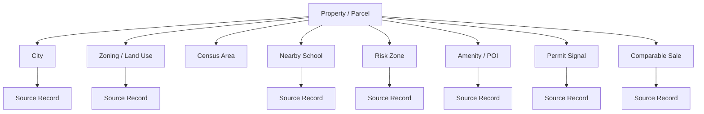
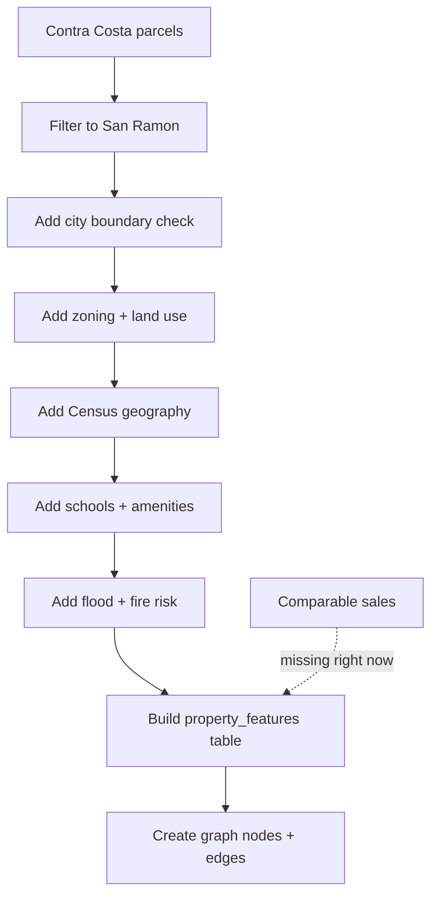

# Knowledge Graph Plan

This page explains how the raw data becomes the Project Lattice knowledge graph.

The simple idea:

> A house can be understood through more than one number. It can have a connected fact file that explains what is true about the property, what is nearby, what risks exist, and which source supports each claim.

## What Is A Knowledge Graph?

A knowledge graph is a set of connected facts.

Instead of keeping everything in one giant spreadsheet, we create small pieces:

- a property
- a city
- a zoning area
- a school
- a flood zone
- a permit
- an amenity
- a source record

Then we connect them with relationships:

- this property is inside this city
- this property is near this school
- this property is inside this fire-risk zone
- this claim came from this source

That is the graph.

## What We Are Trying To Build

The product goal is:

> Given a property, explain whether it looks fairly priced, overpriced, undervalued, risky, or promising, and show the evidence behind the answer.

For the first version, the graph can answer questions like:

| Question | How the graph helps |
| --- | --- |
| What property is this? | Start from the parcel/APN and address fields. |
| Is it really in San Ramon? | Join parcel geometry to city limits. |
| What is the land-use or zoning context? | Join parcel geometry to planning layers. |
| What neighborhood or Census area is it in? | Join parcel geometry to Census tracts/block groups. |
| What schools and amenities are nearby? | Use distance from the parcel to schools and OSM POIs. |
| Is there flood or fire risk? | Intersect parcel geometry with FEMA/CAL FIRE layers. |
| Are there permit or development signals? | Use permit records where they are available. |
| What sold properties are comparable? | Add comparable sales once a permitted source is secured. |

## First Data Path

The first graph can start with Contra Costa / San Ramon because that matches the main story geography.

## Build The Property Feature Table First

Before building a full graph database, build a simple table with one row per property/parcel.

Call it:

`property_features`

Each row can include:

| Field group | Examples |
| --- | --- |
| Property identity | APN, address fields, city, ZIP, parcel geometry |
| Location joins | city, county, Census tract, Census block group |
| Planning joins | zoning code, general-plan land-use category, urban-limit context |
| Risk joins | FEMA flood zone, CAL FIRE fire hazard class |
| School context | nearest schools, distance, district name, grade span |
| Amenity context | nearby parks, shops, restaurants, transit stops, major POI counts |
| Permit context | permit count, permit type/status/date/cost where available |
| Sale context | comparable sale price/date/attributes when available |
| Provenance | source ID, source URL, retrieval date, confidence/check status |

Why start with this table?

- It is easier to review than a graph database.
- It shows which joins work and which joins fail.
- It becomes the input for the first graph load.
- It keeps the team honest about missing data.

## Graph Nodes

These are the first node types we can create.

| Node | What it means | Data source |
| --- | --- | --- |
| `Property` | A property or land parcel | Contra Costa parcels |
| `City` | City boundary or city membership | Contra Costa city limits |
| `ZoningDistrict` | Zoning/planning rule area | Contra Costa zoning |
| `LandUseArea` | General-plan land-use area | Contra Costa general plan |
| `CensusArea` | Tract or block group | Census TIGER boundaries |
| `School` | School or district record | California Department of Education |
| `Amenity` | Nearby POI such as park, shop, restaurant, school, or transit stop | OpenStreetMap |
| `RiskZone` | Flood/fire risk area | FEMA and CAL FIRE |
| `Permit` | Building or development event | San Francisco permits for demo; local permit source still needed for San Ramon |
| `ComparableSale` | Sold property used for valuation | Missing right now |
| `SourceRecord` | The evidence behind a claim | Source registry and file metadata |

## Graph Edges

These are the first relationship types we can create.

| Edge | Plain meaning |
| --- | --- |
| `Property LOCATED_IN City` | The property is inside this city. |
| `Property HAS_ZONING ZoningDistrict` | The property intersects this zoning area. |
| `Property HAS_LAND_USE LandUseArea` | The property intersects this land-use area. |
| `Property INSIDE CensusArea` | The property sits inside a tract or block group. |
| `Property NEAR School` | The property is near a school. |
| `Property NEAR Amenity` | The property is near a useful place. |
| `Property INSIDE RiskZone` | The property intersects a risk area. |
| `Property HAS_PERMIT_SIGNAL Permit` | A permit record is linked to or near the property. |
| `Property COMPARABLE_TO ComparableSale` | A sold property is useful for valuation comparison. |
| `Claim SUPPORTED_BY SourceRecord` | The claim points back to its source. |

## How To Analyze Each Join

Every join needs a simple quality check.

| Join | What to check |
| --- | --- |
| Parcels to city limits | How many parcels are inside San Ramon by geometry? How does that compare with `SNRMN` in parcel city fields? |
| Parcels to zoning | Do zoning polygons cover incorporated San Ramon, or only unincorporated county areas? |
| Parcels to Census | Does every parcel land inside exactly one tract/block group? |
| Parcels to schools | Do school points have clean latitude/longitude? Should we use nearest school or district boundary? |
| Parcels to OSM amenities | Which amenity types matter? How many are duplicates or low-value tags? |
| Parcels to fire risk | Which hazard class applies? What if a parcel crosses two classes? |
| Parcels to flood risk | Current FEMA file has useful attributes, but parcel-level flood geometry still needs a full GIS pull. |
| Parcels to permits | SF permits are strong for demo, but San Ramon-specific permit data still needs a source. |
| Parcels to comparable sales | This is the biggest missing piece for valuation. |

## Provenance Rule

Every graph claim can carry a source.

Example claim:

> Property 123 is inside a high fire hazard zone.

That claim can store:

| Field | Example |
| --- | --- |
| `source_id` | `calfire_fhsz` |
| `source_name` | CAL FIRE Fire Hazard Severity Zones |
| `source_url` | Official CAL FIRE service or download page |
| `local_file` | `data/raw/risk/calfire_fhsz_lra_contra_costa_bbox.geojson` |
| `retrieved_at` | date from the manifest/source registry |
| `join_method` | parcel geometry intersects hazard polygon |
| `confidence` | high, medium, or needs review |

This is what makes the product explainable.

## What Is Ready Now

Ready for first graph work:

- Contra Costa parcels
- Contra Costa city limits
- Contra Costa planning layers
- Census TIGER boundaries
- CDE schools/districts
- OSM San Ramon POIs
- CAL FIRE fire hazard zones
- FEMA flood attributes
- SF permits for a permit-ingestion demo

Not ready yet:

- production valuation
- comparable-sales matching
- San Ramon permit history
- 511 transit joins
- ACS demographic attributes
- full parcel-level FEMA flood geometry

## Recommended First Build

1. Load Contra Costa parcels.
2. Filter likely San Ramon parcels using `SNRMN`.
3. Validate that filter with city-limit geometry.
4. Create `property_features` with parcel identity fields.
5. Add zoning, land use, Census area, schools, OSM amenities, fire risk, and flood attributes.
6. Save join counts and failed-match counts.
7. Create graph nodes from the successful joins.
8. Add `SourceRecord` nodes for every source.
9. Add comparable sales only after the source is legally clear and reviewable.
10. Use the graph to generate explanations, not just a price number.

## Current Verdict

The current data is enough to build the graph and explanation layer.

The current data is not enough to make a production valuation claim because comparable sales are still missing.
